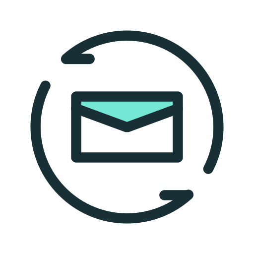

#  gcal-to-outlook


Syncs your Google Calendar into Microsoft Outlook and Teams on Windows. One-way, automatic, and no Azure app registration to set up.

<!-- screenshot -->

---

## Features

- One-way sync from Google Calendar to Outlook / Teams (no feedback loops)
- Incremental updates via Google `syncToken` - only changed events are fetched each cycle
- Creates, updates, and deletes Outlook events to stay in sync with Google
- Two Microsoft integration modes: COM (local Outlook desktop) and Graph API (Microsoft 365)
- SQLite mapping store tracks Google-to-Outlook event ID pairs for reliable deletions
- Configurable polling interval (default: 5 minutes) and lookahead window (default: 60 days)
- Optional title prefix (e.g. `[GCal]`) to visually distinguish synced events in Outlook
- GUI status monitor with system tray, account status, manual sync, log viewer, log export, and an autostart checkbox
- Recovers its own events by a `[sync-id]` marker, so a lost local database does not create duplicates
- First-run setup wizard - no manual JSON editing required for end users

---

## How It Works

`sync.py` runs a polling loop. At each tick it calls the Google Calendar API with a stored `syncToken`, which returns only the events that changed since the last call rather than the full calendar. Each changed event is translated to an Outlook-compatible payload and applied on the Microsoft side: new events are created, existing ones are updated, and cancelled events are deleted. A SQLite database (`sync_state.db`) maps each Google event ID to its corresponding Outlook event ID, which is what allows deletions to work correctly even after the Google event is no longer visible. Every synced event also carries a `[sync-id: <google-id>]` marker in its body. If the database is ever lost or reset, the sync finds its own events by that marker and updates them in place instead of creating duplicates.

There are two ways to write events into Outlook. **COM mode** (the default) drives the locally installed Outlook desktop application through the Windows COM interface via `pywin32` - no Azure app registration required, and events land in the exact Outlook account you specify. **Graph API mode** calls the Microsoft 365 REST API directly using an MSAL token, which works on machines without Outlook installed but requires a registered app in Microsoft Entra with `Calendars.ReadWrite` delegated permission.

The sync is intentionally one-way. Changes made directly in Outlook or Teams are not written back to Google - this avoids duplicate events and infinite update loops. Latency equals the configured polling interval; real-time push would require a publicly reachable endpoint, which is not practical for a personal workstation.

---

## Requirements

- Windows 10 or 11
- Microsoft Outlook desktop installed (required for COM mode, the default)
- Python 3.10 or higher - only if running from source (`python.org/downloads`, check "Add Python to PATH")
- A Google Cloud project with Calendar API enabled and an OAuth Desktop app credential (`google_credentials.json`)

---

## Download & Install (End Users)

The application ships as a Windows installer. The `.exe` is not stored in the repository (binaries do not belong in git) - it is published under **Releases**.

### Download

1. Open the [Releases page](https://github.com/vinicq/gcal-to-outlook/releases).
2. On the latest release, under **Assets**, download `GCalSync-Setup.exe`.
3. Windows SmartScreen may warn that the publisher is unrecognized (the installer is not code-signed). Click **More info -> Run anyway**.

### Install

1. Double-click `GCalSync-Setup.exe`.
2. It installs to `%LOCALAPPDATA%\GCalSync` per user - **no administrator rights required**.
3. The setup wizard opens on first run. It asks which Outlook account to sync with and opens your browser for the Google login - no passwords are stored by the app.
4. After setup completes, the monitor window opens. The status panel shows your connected accounts, last sync time, and sync results. Use "Sync now" to trigger a manual cycle at any time.
5. Tick **"Start automatically when Windows starts"** in the monitor to run the sync silently in the background on every login. Untick it to stop autostart.

> The installer does not bundle `google_credentials.json` (it identifies your own Google Cloud project). Ship that file alongside the installer, or place it next to the installed `GCalSync.exe`, before the first Google login. See [Sharing with Others](#sharing-with-others).

### Uninstall

Open Windows **Settings -> Apps -> Installed apps**, find **GCal Teams Sync**, and choose **Uninstall** (or run `unins000.exe` in the install folder). Uninstalling removes the app, its data files, the autostart launcher, and any legacy scheduled task.

---

## Quick Start (From Source)

```bash
git clone https://github.com/vinicq/gcal-to-outlook.git
cd gcal-to-outlook
python -m venv .venv
.venv\Scripts\activate
pip install -r requirements.txt
python src/app.py
```

The setup wizard runs automatically on first launch. Place `google_credentials.json` in the project root before starting.

---

## Configuration

Copy `config.example.json` to `config.json` and adjust as needed. The setup wizard writes this file for you during first run.

```json
{
  "google": {
    "calendar_id": "primary",
    "credentials_file": "google_credentials.json",
    "token_file": "google_token.json"
  },
  "microsoft": {
    "mode": "com",
    "outlook_account": "you@example.com",
    "client_id": "",
    "tenant_id": "",
    "token_cache_file": "ms_token_cache.bin",
    "calendar_id": ""
  },
  "sync": {
    "poll_interval_seconds": 300,
    "window_days_ahead": 60,
    "default_timezone": "America/New_York",
    "tag_prefix": "[GCal]"
  }
}
```

### Google

| Field | Description |
|---|---|
| `google.calendar_id` | Which Google calendar to read. Use `"primary"` or paste a specific calendar ID. |
| `google.credentials_file` | Path to the OAuth client JSON downloaded from Google Cloud Console. |
| `google.token_file` | Where the Google access token is cached after the first login. |

### Microsoft

| Field | Description |
|---|---|
| `microsoft.mode` | `"com"` (default) to write via local Outlook desktop, or `"graph"` for Microsoft 365 REST API. |
| `microsoft.outlook_account` | COM mode only. The SMTP address of the Outlook account to sync into (e.g. `you@company.com`). Leave blank to use the default account. |
| `microsoft.client_id` | Graph mode only. Application (client) ID from Microsoft Entra. |
| `microsoft.tenant_id` | Graph mode only. Directory (tenant) ID from Microsoft Entra. |
| `microsoft.token_cache_file` | Graph mode only. Where the MSAL token cache is saved. |
| `microsoft.calendar_id` | Graph mode only. Leave empty to use the default Outlook calendar. |

### Sync

| Field | Description |
|---|---|
| `sync.poll_interval_seconds` | How often to check for changes, in seconds. Default: `300` (5 minutes). |
| `sync.window_days_ahead` | How many calendar days ahead to sync. Default: `60`. |
| `sync.default_timezone` | Timezone applied to all-day events that carry no explicit zone (IANA format). |
| `sync.tag_prefix` | String prepended to synced event titles. Set to `""` to disable. |

---

## Executable Modes

`GCalSync.exe` (and `src/app.py`) accept an optional mode argument:

| Mode | Command | What it does |
|---|---|---|
| Default | `GCalSync.exe` | Opens the setup wizard if not configured, then opens the monitor. |
| `setup` | `GCalSync.exe setup` | Runs the setup wizard only, then exits without opening the monitor. |
| `run` | `GCalSync.exe run` | Starts the background sync loop silently (used by autostart). |
| `once` | `GCalSync.exe once` | Runs a single sync cycle and exits. |
| `login` | `GCalSync.exe login` | Re-authenticates both accounts and exits. |
| `reset` | `GCalSync.exe reset` | Clears the `syncToken`, forcing a full calendar reload on the next cycle. |

---

## Building from Source

### 1. The executable

With the virtual environment active, run:

```bat
build.bat
```

`build.bat` checks for PyInstaller (installing it if missing), bundles `src/app.py` into a single `GCalSync.exe` at the project root, and removes the temporary build folder. The resulting executable includes all dependencies and requires no Python installation on the target machine.

### 2. The installer

The installer is built with [Inno Setup 6](https://jrsoftware.org/isdl.php). With `GCalSync.exe` already built, compile the script:

```bat
"%LOCALAPPDATA%\Programs\Inno Setup 6\ISCC.exe" installer.iss
```

This produces `installer\GCalSync-Setup.exe` - a per-user installer (no admin) that installs to `%LOCALAPPDATA%\GCalSync`, registers a native uninstaller in Windows "Apps & features", and creates Start Menu shortcuts. Autostart is controlled from inside the app, not by the installer.

### Publishing a release

1. Push the source to GitHub.
2. Create a new release with a version tag (e.g. `v1.0.0`).
3. Attach `installer\GCalSync-Setup.exe` as a release asset.

Do not commit or distribute `google_credentials.json`, `config.json`, `google_token.json`, `ms_token_cache.bin`, or `sync_state.db` - these contain personal credentials and are specific to each user. The `.gitignore` already excludes them, along with the built `GCalSync.exe` and the `installer/` output.

---

## Sharing with Others

To distribute this to other people, share one `google_credentials.json` from a single Google Cloud project.

1. Create a Google Cloud project, enable the Calendar API, and create an OAuth Desktop app credential.
2. Download the resulting `google_credentials.json` and include it with `GCalSync.exe` when sharing.
3. Each recipient double-clicks `GCalSync.exe` and logs in with their own Google account in the browser. The credentials file identifies your Cloud project; it is not a secret. The user's personal access token is generated locally and never shared.

By default, Google limits OAuth apps in test mode to 100 authorized users. If you need to share with more people, publish the app in Google Cloud Console (OAuth consent screen - set to "External" and click "Publish App"). No review is required for apps that only request Calendar read access.

Microsoft side does not need any shared credential in COM mode - the sync writes directly into the locally installed Outlook, which is already authenticated through the user's existing Windows session.

---

## Known Limitations

- Attachments are not synced.
- Guest and attendee lists are not synced.
- Recurring events are expanded to individual occurrences (`singleEvents=True`), so each occurrence appears as a separate event in Outlook rather than a recurring series.
- Custom reminders beyond the Outlook default are not synced.
- Sync is one-way only - changes made in Outlook are not written back to Google.
- Windows only. COM mode requires Outlook desktop to be installed and running (or at least configured).
- If the machine is off or asleep during a calendar change, the missed changes are picked up on the next sync cycle.

---

## Contributing

1. Fork the repository and create a branch from `main`.
2. Make focused, well-described commits in English.
3. Open a pull request describing what changed and why.
4. Verify that `GCalSync.exe once` (or `python src/app.py once`) runs without errors before submitting.

Bug reports and feature requests are welcome as GitHub Issues.

---

## License

MIT. See [LICENSE](LICENSE).
